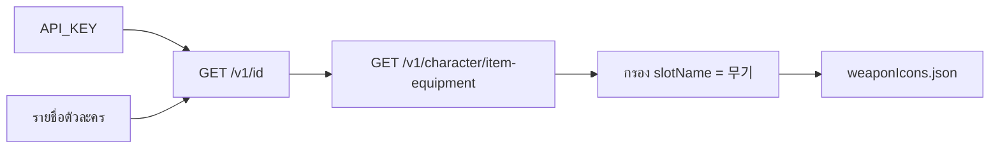

# MapleStory M — Nexon Open API (เอกสารที่เก็บไว้)

แหล่งต้นทาง: [openapi.nexon.com/game/maplestorym/?id=1](https://openapi.nexon.com/game/maplestorym/?id=1)

วันที่ดึง: 2026-07-18

> **หมายเหตุ Nexon:** ข้อมูลที่ดึงจาก Open API ต้องอัปเดตอย่างน้อยทุก 30 วัน  
> เกมดาต้าเฉลี่ยพร้อมใช้หลัง ~10 นาที · ดูข้อมูลได้ตั้งแต่ 2022-01-01

## ไฟล์ YAML ทางการ (สำเนาใน repo)

| หมวด (category id) | ไฟล์ใน repo | URL ต้นทาง |
|---|---|---|
| 1 Character | [`01-character.yaml`](maplestorym/01-character.yaml) | `…/static/api/maplestorym/1_ko_script20260709010559.yaml` |
| 53 Union | [`53-union.yaml`](maplestorym/53-union.yaml) | `…/56_ko_script20251127010357.yaml` |
| 52 Guild | [`52-guild.yaml`](maplestorym/52-guild.yaml) | `…/57_ko_script20251218021741.yaml` |
| 54 Ranking | [`54-ranking.yaml`](maplestorym/54-ranking.yaml) | `…/58_ko_script20251218022641.yaml` |
| 25 Notice | [`25-notice.yaml`](maplestorym/25-notice.yaml) | `…/28_ko_script20250414070823.yaml` |

Base URL: `https://open.api.nexon.com`  
Header ที่ต้องส่งทุกครั้ง: `x-nxopen-api-key: <API_KEY>`

## Character endpoints ที่เกี่ยวกับไอคอนไอเทม

### 1) หา ocid

`GET /maplestorym/v1/id?character_name=…&world_name=…`

### 2) อุปกรณ์ที่สวม (ไม่รวมแคช) ← แหล่งหลักของไอคอนเกียร์

`GET /maplestorym/v1/character/item-equipment?ocid=…`

Response schema `CharacterItemEquipment` มี `item_equipment[]` โดยแต่ละชิ้นมีอย่างน้อย:

| ฟิลด์ | ความหมาย |
|---|---|
| `item_name` | ชื่อไอเทม |
| `item_equipment_page_name` | 부위 (เช่น อาวุธ) |
| `item_equipment_slot_name` | สล็อต |
| `item_grade` | เกรด/แรงก์ |
| `item_icon` | **ไอคอนไอเทม** (string) |
| `equipment_level` | เลเวลสวมได้ |
| `starforce_upgrade` | สตาร์ |
| `item_potential_option_grade` | เกรดโพเทฯ |

ไม่มี endpoint แบบ “ค้นหาไอเทมทั้งหมดในเกม” หรือ “ขอไอคอนจากชื่อ Absolab Hammer โดยตรง”

### 3) CDN ไอคอนสแตติก

รูปแบบที่ใช้งานได้ (ยืนยัน HEAD 200):

```
https://open.api.nexon.com/static/maplestorym/asset/icon/{hash}
```

ค่า `item_icon` จาก API มักเป็น URL เต็มในรูปแบบนี้ (หรือ hash ที่ประกอบกับ base ได้)  
**hash คำนวณจากชื่อไอเทมไม่ได้** — ต้องได้จาก response ของ character equipment

ตัวอย่าง Absolab hammer:

```
https://open.api.nexon.com/static/maplestorym/asset/icon/9c2c9f28adce985e3d061966899c8cf2486cfab31e03272256d68cebfb077e38affe550c311d9ca9528c310014270e586aa7c8563adac5382ffd1438374bcea1e63a3c30cd96b0b38d8371fd98c44061
```

### Character paths อื่นใน YAML (อ้างอิง)

- `/maplestorym/v1/character/basic`
- `/maplestorym/v1/character/stat`
- `/maplestorym/v1/character/cashitem-equipment` → `cash_item_icon`
- `/maplestorym/v1/character/symbol` → `symbol_icon`
- skill / pet / android / jewel / link-skill / vmatrix / hexa …

## วิธีสร้างแคตตาล็อกไอคอน Weapon (แนวทาง)



1. มี API key จาก [openapi.nexon.com](https://openapi.nexon.com/) ใน `.env` เป็น `NEXON_API_KEY=` (ดู `.env.example`)
2. จาก ranking (เช่น combat-power) ได้รายชื่อตัวละครหลายอาชีพ
3. เรียก `item-equipment` → เก็บคู่ที่ **`item_equipment_slot_name == "무기"`**  
   - `item_equipment_page_name` = ชนิดอาวุธ (단검, 활, …)  
   - **อย่า** match substring `무기` ทั้งหน้า — จะติด `보조무기`
4. บันทึก `planner/src/data/nexon/weaponIcons.json`
5. refresh อย่างน้อยทุก 30 วันตามข้อกำหนด Nexon

### สคริปต์ที่พร้อมใช้

```bash
# จาก root ของ repo — แนะนำ: ดึงแบบแบ่งตามอาชีพ (ทุก job ใน ranking)
python scripts/harvest_weapon_icons.py --by-class --scan-pages 30 --per-class 6 --sleep 0.25

# แบบเดิม: ไล่ ranking จากบนลงล่างตามจำนวนตัวละคร
python scripts/harvest_weapon_icons.py --pages 10 --chars 400
```

**หมายเหตุอาชีพ:** Nexon ranking **ไม่มี**พารามิเตอร์กรอง job (ต่างจาก UI ของ [maplemhub item ranking](https://maplemhub.com/item_ranking) ที่กรองฝั่งเว็บ)  
สคริปต์ `--by-class` จึงสแกน ranking แล้วเลือกตัวละครสูงสุด N ตัวต่อ `character_class` ก่อนดึง `item-equipment` เพื่อให้ครบทุกอาชีพที่โผล่ใน ranking

ถ้าเจอ HTTP 429 ให้รอสักครู่แล้วรันใหม่ — สคริปต์มี retry/backoff และ **merge** กับ `weaponIcons.json` เดิม

ผลลัพธ์ตัวอย่าง (2026-07-17): ตรวจ 60 ตัวละคร → ได้ weapon ไม่ซ้ำ 32 ชิ้น (Absolab / Arcane เป็นหลักจาก top combat-power)

ใน Gear Edit (Main Weapon): กดที่ไอคอนซ้ายบนเพื่อเปิด popup เลือกจาก catalog  
ถ้า `harvestedAt` เก่า ≥ 30 วัน จะมีแถบเตือน NOTICE ใน popup — **รันสคริปต์ด้านบนซ้ำ** เพื่ออัปเดต `weaponIcons.json`

วาง URL เต็มใน `GearItem.iconUrl` / อัปโหลดเองยังใช้ได้ (`normalizeIconUrl` รับ `https://`)

### ความปลอดภัย

- ห้าม commit `.env` / API key
- ถ้าเคยวาง key ในแชท ควร **rotate key** ที่เว็บ Nexon Open API แล้วอัปเดต `.env`
